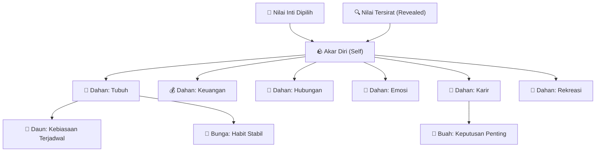
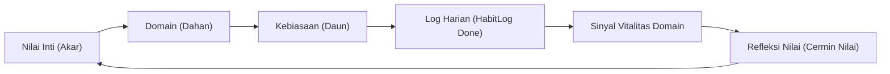

# 08 — Konsep Pohon Pertumbuhan Daoji (Growth Map)

> **Status:** Iterasi 2 / Advanced Visual System — *Bukan scope MVP Core.*
> MVP tetap menggunakan Tree Vitality Card + Action of the Day + Journal.
>
> **Constraints canonical:**
> Anti-Guilt · Offline-first · Mobile-first · Accessibility-first · Calm Tech

---

## 1. Prinsip Non-Negotiable

Setiap keputusan desain, bahasa, dan visual dalam dokumen ini harus mematuhi prinsip-prinsip berikut tanpa pengecualian:

| Prinsip | Implementasi |
|---|---|
| **Pohon tidak pernah mundur** | Tidak ada animasi mengecil, mati, layu, kering, atau terbakar |
| **Defisit = sinyal perhatian, bukan hukuman** | Domain skor rendah → glow lebih lembut + ring perhatian halus, BUKAN tampilan rusak |
| **Tidak ada streak punishment** | Habit yang tidak diselesaikan hari ini hanya membuat node "belum aktif" — tidak mengurangi progres visual |
| **Semua visual punya label aksesibilitas** | Setiap node harus punya `semanticLabel` yang deskriptif |
| **Aman untuk fotosensitivitas** | Animasi lambat (≤800ms), tidak flashing, tidak bergantung pada warna saja |

### Kata-kata yang Dilarang di UI dan Dokumen

| ❌ Jangan | ✅ Gunakan |
|---|---|
| dahan layu | dahan butuh perhatian |
| dahan kering | glow lebih redup |
| daun mati | daun belum aktif hari ini |
| rusak / hancur | dormant / tenang |
| kamu gagal | area yang bisa diberi ruang |
| nilai palsumu | nilai yang sedang berkembang |
| niat di atas kertas | nilai yang perlahan muncul dalam tindakan |

---

## 2. Scope per Fase

Dokumen ini hanya mendefinisikan **Iterasi 2**. Iterasi sebelumnya tetap berlaku dan tidak digantikan.

| Fase | Scope | Status |
|---|---|---|
| **MVP (Existing)** | `TreeVitalityCard` + `OrganicTreePainter` + pohon PNG/fallback | ✅ Selesai |
| **Iterasi 1** | Domain aura `activeDomainColor` + `DomainInsightDialog` + chip domain interaktif | ✅ Selesai |
| **Iterasi 2 (Dokumen ini)** | **Growth Map** node-based — visualisasi pohon interaktif berbasis data | 🔵 Rancangan |

---

## 3. Metafora Pohon: Mapping Konseptual

Pertumbuhan diri dalam Daoji dianalogikan sebagai struktur pohon hidup dengan empat lapisan yang saling terhubung.

### Diagram Struktur (Top-Down)



### Diagram Feedback Loop (Dua Arah)



### Tabel Mapping Elemen Pohon

| Elemen Pohon | Representasi Data | Visual | Interaksi |
|---|---|---|---|
| **Akar utama** | `UserProfiles.coreValues` (Declared) | Garis tebal/solid | Tap → ringkasan nilai |
| **Serabut akar** | `revealedValueScores` (Revealed) | Garis tipis outline/shimmer | Tap → buka Cermin Nilai |
| **Overlap akar** | Declared ∩ Revealed | Garis lebih terang | — |
| **Akar netral** | `minResponses` belum tercapai | Outline netral + CTA | Tap → "Mulai Cermin Nilai 🪞" |
| **Dahan sehat** | Skor domain 8–10 | Glow penuh, warna solid | Tap → DomainInsightDialog |
| **Dahan netral** | Skor domain 5–7 | Warna normal, ring tipis | Tap → DomainInsightDialog |
| **Dahan butuh perhatian** | Skor domain 1–4 | Glow lebih redup + ikon kecil ⚠ | Tap → DomainInsightDialog |
| **Dahan unknown** | Tidak ada data skor | Outline netral + CTA | Tap → "Isi Weekly Pulse" |
| **Daun aktif** | Habit terjadwal hari ini, belum selesai | Lingkaran redup, soft | Tap → quick-toggle Done |
| **Daun menyala** | HabitLog status = Done hari ini | Glow lembut 800ms | Tap → batalkan |
| **Bunga** | Habit yang sudah sangat rutin (≥30 hari streak) | Ikon bunga kecil | Tap → lihat detail habit |
| **Buah** | DecisionEntry penting | Node bundar lebih besar | Tap → buka Decision Journal |
| **Node "+"** | Domain aktif tanpa habit terjadwal hari ini | Lingkaran semi-transparan + ikon + | Tap → `/add-habit?domain=X` |

---

## 4. Data Source

Seluruh visual Growth Map dibangun dari data yang sudah ada di database Drift lokal:

| Bagian Visual | Provider / Tabel | Field kunci |
|---|---|---|
| Akar (Declared) | `UserProfiles` | `coreValues` (JSON list) |
| Akar (Revealed) | `UserProfiles` | `revealedValueScores` (JSON map) |
| Dahan skor | `UserProfiles` | `latestDomainScores` (JSON map) |
| Dahan skor fallback | `WeeklyPulse` | `whoScore` per domain |
| Daun kebiasaan | `dashboardDataProvider` | `habitsToday: List<HabitWithLog>` |
| Daun status | `HabitLog` | `status` (Done/Missed/null) |
| Bunga | `HabitLog` | streak hitung ≥ 30 hari |
| Buah | `DecisionEntries` | `isImportant = true` (opsional filter) |

---

## 5. Visual State & Threshold Domain

Threshold domain menggunakan skala 1–10 yang sudah ada di `latestDomainScores`:

| Skor domain | State | Nama State | Visual yang Diizinkan |
|---:|---|---|---|
| 8–10 | Stabil | `healthy` | Glow lembut, warna penuh |
| 5–7 | Netral | `neutral` | Warna normal, ring tipis |
| 1–4 | Butuh perhatian | `needsAttention` | Glow redup + ikon ⚠ kecil (BUKAN layu) |
| Tidak ada data | Tidak diketahui | `unknown` | Outline netral + CTA "Isi Weekly Pulse" |
| Data > 14 hari | Perlu update | `stale` | Badge "perlu check-in" |

---

## 6. Model Event (Energy Loop)

Setiap event di aplikasi memicu animasi visual tertentu pada Growth Map:

| Event | Trigger Data | Visual pada Growth Map | Durasi |
|---|---|---|---|
| Habit Done | `HabitLog.status = Done` | leaf glow pulse lembut | 800ms |
| Habit Missed | `HabitLog.status = Missed` | leaf kembali ke state netral (tidak ada hukuman) | — |
| Recovery Mode | `supportMode = Recovery` | soft blue overlay di seluruh pohon | konstan |
| Action of the Day | domain di `dashboardDataProvider` | aura lembut di dahan domain aktif | konstan |
| Weekly Pulse updated | insert `WeeklyPulse` | branch ring pulse sekali | 600ms |
| Cermin Nilai selesai | new `ValueDilemmaResponses` | root shimmer halus sekali | 400ms |

---

## 7. Spesifikasi Interaksi (Mobile-First)

| Platform | Interaksi |
|---|---|
| **Mobile (utama)** | tap, long press, bottom sheet |
| **Desktop / Web (opsional)** | klik, hover tooltip singkat |
| **Aksesibilitas** | `semanticLabel`, focus traversal, tidak hanya warna |

Contoh:
> Tap node dahan untuk membuka DomainInsightDialog. Long press untuk tooltip ringkas skor. Pada desktop/web, hover dapat menampilkan preview singkat skor domain.

Ketentuan interaksi:
- **Quick-toggle** hanya berlaku untuk **Daun (Habit aktif hari ini)** — tap sekali centang, tap lagi batalkan.
- **Decision Journal** tampil sebagai **Buah** — membuka halaman detail, bukan quick-toggle.
- **Domain Node** selalu membuka `DomainInsightDialog` — tidak ada quick-toggle di level ini.
- **Root Node** membuka ringkasan nilai (Declared + Revealed side by side).

---

## 8. Adaptasi Skin (Calm Tech Palette)

Setiap skin menghasilkan variasi visual yang tetap selaras dengan prinsip Calm Tech: animasi lambat, tidak menyilaukan, tidak overstimulating.

| Skin ID | Nama Tema | Warna Dahan | Warna Daun | Aura Root | Nama Calm |
|---|---|---|---|---|---|
| `Wooden` | Classic Nature | `#4CAF50` hijau daun | `#8BC34A` lime | `#8B6B4F` cokelat kayu | **Nature Calm** |
| `Sakura` | Spring Blossom | `#CE93D8` lavender | `#F48FB1` pink lembut | `#EF9A9A` blush | **Sakura Dawn** |
| `Maple` | Autumn Ember | `#FFA726` oranye hangat | `#FFCC80` amber lembut | `#A1887F` tembaga | **Maple Ember** |
| `Bonsai` | Zen Forest | `#2E7D32` hijau tua | `#388E3C` hijau hutan | `#1B5E20` gelap damai | **Bonsai Zen** |

Tidak ada efek: neon, cyberpunk, hologram, matrix, atau flashing yang membuat lelah mata.

---

## 9. Rencana Implementasi Teknis

### Struktur File Baru

```text
app/lib/src/features/dashboard/widgets/growth_map/
  growth_map_widget.dart         # Widget utama (replaces TreeDisplayWidget di Iterasi 2)
  growth_map_painter.dart        # CustomPainter untuk menggambar garis konektor
  growth_map_node.dart           # Data model node (RootNode, BranchNode, LeafNode, FruitNode)
  growth_map_layout.dart         # Kalkulasi posisi node berdasarkan ukuran layar
  growth_map_semantics.dart      # Semantic label builder untuk aksesibilitas
```

### View Model Provider Baru

```text
app/lib/src/features/dashboard/growth_map_provider.dart
```

```dart
class GrowthMapViewModel {
  final RootNode root;              // Self + Core Values
  final List<DomainBranchNode> branches;  // 6 domain nodes
  final List<HabitLeafNode> leaves;       // Habit aktif hari ini
  final List<StableHabitFlower> flowers;  // Habit stabil ≥30 hari
  final List<DecisionFruitNode> fruits;   // Decision Journal entries
}
```

### Test yang Harus Dibuat

```text
app/test/growth_map_view_model_test.dart
app/test/growth_map_domain_state_test.dart
app/test/growth_map_accessibility_test.dart
```

**Test minimal wajib:**
1. Domain skor rendah → state `needsAttention`, bukan `withered`/`dead`.
2. Habit non-daily hanya muncul di hari yang terjadwal.
3. Decision Journal muncul sebagai `FruitNode`, bukan quick-toggle leaf.
4. Recovery Mode tidak mengurangi progress visual manapun.
5. Setiap node menghasilkan `semanticLabel` yang tidak kosong.
6. Root node tanpa data Revealed Values → state `unknown` + CTA "Mulai Cermin Nilai".

---

## 10. Copywriting Anti-Guilt (Referensi)

Seluruh teks yang muncul di dalam widget Growth Map harus mengikuti panduan ini:

| Situasi | ❌ Jangan | ✅ Gunakan |
|---|---|---|
| Domain skor rendah | "Domain ini lemah" | "Domain ini bisa diberi lebih banyak ruang" |
| Habit belum selesai | "Kamu belum melakukan ini" | "Belum aktif hari ini" |
| Tidak ada data nilai | "Nilai hidupmu kosong" | "Mulai refleksi untuk menemukan polamu 🪞" |
| Habit stabil | "Kamu sudah bagus" | "Pola ini sudah mulai mengakar 🌸" |
| Recovery mode aktif | "Kamu sedang sakit" | "Mode Istirahat aktif — pohon tetap tumbuh dengan caranya sendiri" |
