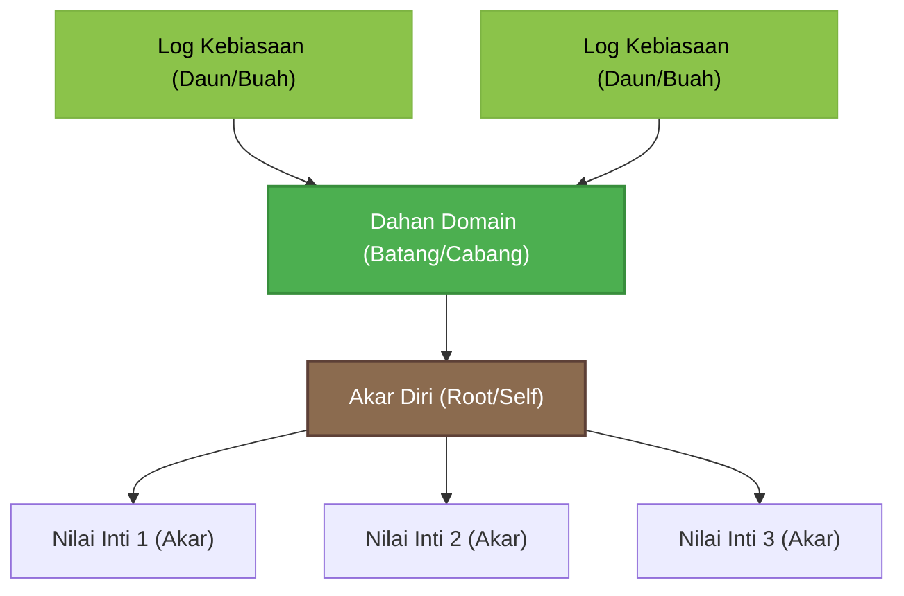

# Konsep Pohon Pertumbuhan LifeTree (The Growth Tree of Life)

Dokumen ini mendefinisikan konsep metafora **"Pohon Pertumbuhan"** kustom yang dirancang khusus untuk aplikasi **LifeTree**. Metafora ini memadukan konsep biologi botani dengan *Skill Tree* (RPG) dan *Behavior Tree* (AI) untuk memvisualisasikan perkembangan diri secara interaktif dan offline-first.

---

## 1. Metafora Utama: Tiga Lapisan Pertumbuhan

Pertumbuhan diri dalam LifeTree dianalogikan sebagai struktur pohon hidup yang terdiri dari tiga bagian utama: **Akar (Roots)**, **Dahan (Branches)**, dan **Daun/Buah (Leaves/Fruits)**.

### A. Lapis Akar (Roots): Kompas Nilai Inti (Core Values)
Akar berada di bawah permukaan, tidak terlihat langsung di dasbor utama tetapi menentukan kekuatan seluruh pohon.
*   **Representasi:** 3 Core Values (baik *Dipilih* secara sadar maupun *Tersirat* dari Cermin Nilai).
*   **Fungsi:** Menyerap "nutrisi" motivasi. Tanpa akar yang kuat (nilai-nilai yang jelas), dahan dan daun tidak memiliki dasar untuk tumbuh kokoh.

### B. Lapis Dahan (Branches): Domain Kehidupan (Life Domains)
Batang utama bercabang menjadi dahan-dahan kokoh yang menopang seluruh struktur daun.
*   **Representasi:** 6 Domain Utama (Tubuh, Keuangan, Hubungan, Emosi, Karir, Rekreasi).
*   **Fungsi:** Menyalurkan energi. Kesehatan dahan diukur dari skor domain (Radar Chart). Dahan yang mengalami defisit (skor rendah) akan tampak layu/kering (warna redup/amber), sementara dahan sehat akan bersinar (glow).

### C. Lapis Daun & Buah (Leaves & Fruits): Tindakan Harian (Habits & Decisions)
Daun-daun kecil dan buah matang yang tumbuh di ujung setiap ranting dahan.
*   **Representasi:** Kebiasaan aktif hari ini (*Habits*) dan keputusan penting (*Decisions*).
*   **Fungsi:** Menghasilkan energi baru. Setiap kali pengguna menyelesaikan kebiasaan hari ini (mencentang log kebiasaan), daun tersebut akan berfotosintesis dan menyala terang, mengirimkan aliran energi visual kembali ke dahan dan akar.

---

## 2. Siklus Aliran Energi (Feedback Loop)

Pertumbuhan diri bukanlah proses searah, melainkan sebuah siklus timbal balik yang konstan:

### A. Aliran Top-Down (Inspirasi ke Aksi)
1.  **Akar (Nilai Inti)** memberikan dasar filosofis mengapa suatu tindakan penting.
2.  Energi inspirasi naik menutrisi **Dahan (Domain)** yang relevan.
3.  Ujung dahan menumbuhkan **Daun (Kebiasaan)** nyata sebagai manifestasi praktis dari nilai tersebut.
*   *Contoh:* Nilai *Kebebasan* (Akar) menutrisi domain *Keuangan* (Dahan) untuk melakukan kebiasaan *Menabung 10% Gaji* (Daun).

### B. Aliran Bottom-Up (Aksi ke Validasi)
1.  Setiap penyelesaian **Daun (Kebiasaan)** harian memicu fotosintesis energi.
2.  Energi mengalir turun untuk meningkatkan vitalitas **Dahan (Domain)**.
3.  Akumulasi energi ini memvalidasi kekuatan **Akar (Nilai)**, memastikan bahwa nilai yang kita pilih bukan sekadar niat di atas kertas, melainkan benar-benar mewujud dalam tindakan.

---

## 3. Sistem Klasifikasi Pohon (Tech Tree / Skill Tree)

Konsep pohon ini direpresentasikan secara visual sebagai **Growth Tech Tree** dengan elemen-elemen interaktif sebagai berikut:

| Elemen Pohon | Representasi UI | Interaktivitas |
|---|---|---|
| **Pangkal Akar** | Node Sentral (Akar Diri) di bagian bawah dasbor. | Menampilkan nama pengguna dan total hari kumulatif keberhasilan saat di-hover. |
| **Cabang Utama** | Garis konektor bercahaya dari Root ke Dahan. | Menunjukkan jalur aliran energi harian. |
| **Node Dahan** | 6 tombol lingkaran berwarna redup/terang (Tubuh, Keuangan, dll). | Tapping memicu **DomainInsightDialog** (menampilkan kutipan, animasi pulse, dan rekomendasi mikro). |
| **Ranting Daun** | Garis tipis konektor dari Dahan ke Kebiasaan. | Menyala solid jika kebiasaan selesai. |
| **Node Daun** | Lingkaran kecil/chip inisial kebiasaan di ujung dahan. | Tapping langsung mencentang/membatalkan kebiasaan (*Quick-toggle*). |
| **Node Daun Kosong** | Tombol "+" semi-transparan jika domain belum punya kebiasaan aktif hari ini. | Tapping membuka formulir tambah kebiasaan baru (`/add-habit`). |

---

## 4. Penyelarasan Tema Skin (Aesthetic Adaptation)

Untuk mendukung fitur kustomisasi (Skin Shop), visualisasi pohon hologram ini beradaptasi dengan palette skin yang dibeli oleh pengguna:

1.  **Wooden (Default / Classic):** 
    *   *Tema:* Alam klasik. Garis cabang berwarna hijau daun (`#4CAF50`), node akar berwarna cokelat kayu (`#8B6B4F`), aura cahaya hijau lembut.
2.  **Sakura (Neon Pink):** 
    *   *Tema:* Hologram musim semi Jepang. Garis cabang berwarna putih-pink neon (`#F06292`), node menyala merah muda pastel, partikel kelopak bunga sakura melayang lembut.
3.  **Maple (Cyberpunk Amber):** 
    *   *Tema:* Kontrol panel futuristik musim gugur. Garis cabang berwarna jingga keemasan (`#FFA726`), node menyala amber hangat, efek sirkuit tembaga bercahaya.
4.  **Bonsai (Matrix Green):** 
    *   *Tema:* Konsol coding digital minimalis. Garis cabang berwarna hijau terang digital (`#2E7D32`), node menyala hijau neon matriks, efek data aliran biner tipis.

---
Dengan konsep **Growth Tree of Life** ini, dasbor aplikasi tidak lagi menampilkan ilustrasi pohon statis yang membosankan, melainkan sebuah **papan kendali pertumbuhan yang dinamis, interaktif, dan penuh makna**.
